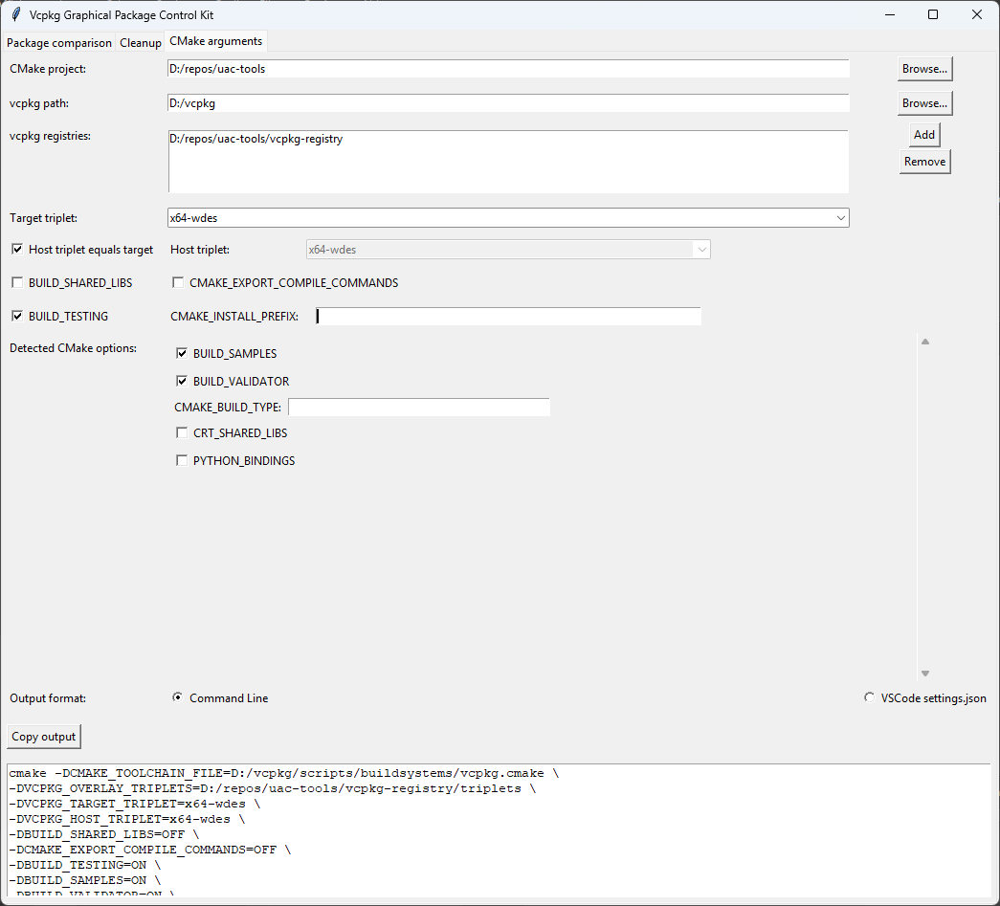

# Vcpkg Graphical Package Control Kit

A graphical tool for managing and analyzing vcpkg binary caches with a user-friendly interface.

## Features

### Package Comparison
Compare build metadata and ABI information between different builds of the same package. Browse your vcpkg cache, select a package, choose two build dates, and instantly see what has changed between builds.


### Cleanup
Easily free up disk space by selectively removing directories from your vcpkg installation. Choose which folders to clean:
- **downloads** - Downloaded source files  
- **packages** - Built packages
- **buildtrees** - Build artifacts and source trees


### CMake Arguments
This feature helps you generate CMake command-line arguments to configure your projects with vcpkg integration.

- **Automatic Option Detection**: The tool scans your project's CMakeLists.txt files to automatically detect available CMake options, which you can then customize as needed.
- **Triplet Detection**: Triplets are automatically gathered from your vcpkg installation and any configured vcpkg registries, ensuring you have access to all available build configurations.
- **Flexible Output Formats**: Generate output in command-line format for direct terminal use, or in a format compatible with VSCode's settings.json for seamless integration into your development workflow.



## Requirements

- Python 3.7+
- `VCPKG_DEFAULT_BINARY_CACHE` environment variable must be set to your vcpkg binary cache directory

## Usage

```bash
python vcpkg-cache.py