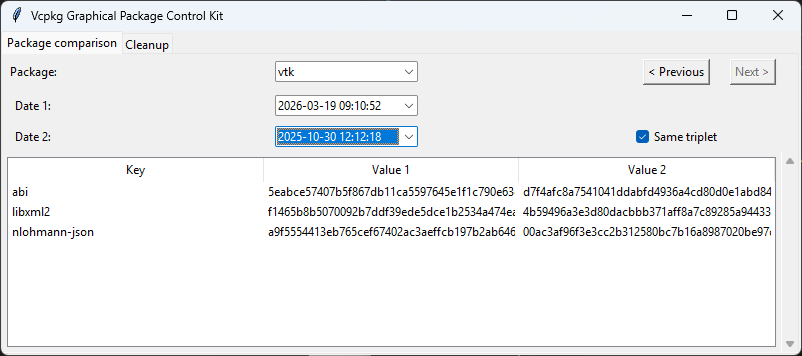
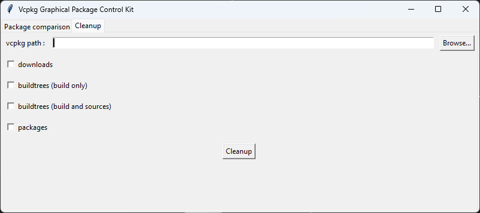

# Vcpkg Graphical Package Control Kit

A graphical tool for managing and analyzing vcpkg binary caches with a user-friendly interface.

## Features

### Package Comparison
Compare build metadata and ABI information between different builds of the same package. Browse your vcpkg cache, select a package, choose two build dates, and instantly see what has changed between builds.



### Cleanup
Easily free up disk space by selectively removing directories from your vcpkg installation. Choose which folders to clean:
- **downloads** - Downloaded source files  
- **packages** - Built packages
- **buildtrees** - Build artifacts and source trees



## Requirements

- Python 3.7+
- `VCPKG_DEFAULT_BINARY_CACHE` environment variable must be set to your vcpkg binary cache directory

## Usage

```bash
python vcpkg-cache.py